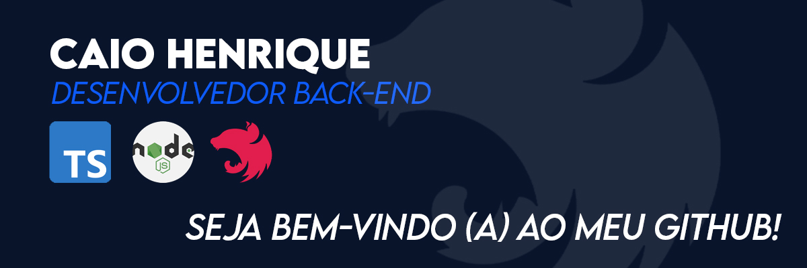

# Opa, eu sou Caio! 🤞

#### 💻 Desenvolvedor Back-end | +2 anos de experiência

#### 🤓 Aprendendo sobre DevOps e Cloud Computing

#### 🕹️ Fã de Pokémon e histórias criativas!

---

## ⚙️ Tecnologias mais utilizadas

---

## ✉️ Onde me encontrar

---

## Dá uma olhada no que já construí ⬇️⬇️